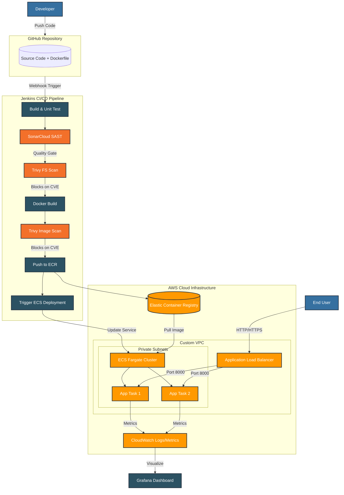

# DevOps Toolbox — AWS ECS Fargate Deployment


A production-grade DevOps portfolio project demonstrating a complete CI/CD lifecycle — from containerized application to automated AWS ECS Fargate deployment, with integrated security scanning and observability.

> 📸 **[View full project screenshots and visual walkthrough →](./docs/SHOWCASE.md)**



---

## What This Project Demonstrates

| Pillar | Implementation |
|---|---|
| **Infrastructure as Code** | Modular Terraform — VPC, ALB, ECR, ECS, Security Groups, IAM |
| **CI/CD Automation** | Jenkins Declarative Pipeline (Build → Scan → Push → Deploy) |
| **DevSecOps** | SonarCloud SAST + Aqua Trivy CVE scanning before every deployment |
| **Container Orchestration** | AWS ECS Fargate with target-tracking auto-scaling |
| **Observability** | Grafana dashboards on top of CloudWatch metrics (CPU, Memory, 5xx) |
| **Security** | IAM Roles, private Security Groups, no hardcoded AWS credentials |
| **State Management** | Remote S3 backend with DynamoDB locking |

---

## Repository Structure

```
.
├── app/                        # FastAPI Python application
│   ├── main.py                 # Entrypoint & /health route
│   ├── Dockerfile              # Multi-stage build, non-root user
│   ├── .dockerignore           # Prevents sensitive files from leaking into image
│   ├── sonar-project.properties
│   ├── routers/                # API route handlers
│   ├── services/               # Core business logic
│   ├── static/                 # CSS & static assets
│   ├── templates/              # Jinja2 HTML templates
│   └── tests/                  # Pytest unit tests
├── terraform/
│   ├── main.tf                 # Root module — calls all sub-modules
│   ├── backend.tf              # S3 remote state + DynamoDB locking
│   ├── iam.tf                  # Jenkins EC2 IAM instance profile
│   ├── environments/dev/       # Environment-specific tfvars
│   └── modules/
│       ├── vpc/
│       ├── alb/
│       ├── ecs/
│       ├── ecr/
│       └── security/
├── jenkins/
│   └── Jenkinsfile             # Declarative pipeline definition
├── scripts/
│   ├── bootstrap-backend.sh    # Creates S3 bucket & DynamoDB table
│   ├── cleanup-backend.sh      # Tears down remote state resources
│   └── setup-jenkins.sh        # Zero-touch Jenkins + Trivy + Grafana install
├── monitoring/
│   └── grafana-dashboard.json  # Pre-built CloudWatch dashboard template
└── docs/
    ├── SHOWCASE.md             # Visual walkthrough with screenshots
    └── screenshots/
```

---

## Architecture Decision: Public Subnets (Cost vs. Isolation)

ECS tasks run in **public subnets** restricted by tight Security Groups (tasks only accept traffic originating from the ALB's Security Group). This deliberately avoids NAT Gateways and VPC Endpoints, saving **~$55–$90/month** in baseline networking costs — a reasonable trade-off for a portfolio/startup environment.

---

## FinOps — Cost Estimate

| Resource | Specification | Est. Monthly Cost |
|---|---|---|
| Application Load Balancer | 1 ALB (us-east-1) | ~$16.00 |
| ECS Fargate | 2 Tasks × (0.25 vCPU, 0.5 GB) | ~$16.00 |
| Jenkins Server | 1 EC2 t3.medium | ~$30.40 |
| S3 + DynamoDB (state) | Minimal usage | ~$1.00 |
| **Total** | | **~$63.40 / month** |

> Estimates based on `us-east-1` on-demand pricing. Costs vary by region and usage.

---

## Quick Start

### Local Development

```bash
docker-compose up --build
# App: http://localhost:8000
# Health: http://localhost:8000/health
```

### Deploy to AWS

#### 1. Bootstrap remote state

```bash
./scripts/bootstrap-backend.sh
```

#### 2. Deploy infrastructure

```bash
cd terraform
terraform init
terraform apply -var-file="environments/dev/terraform.tfvars" -auto-approve
```

#### 3. Provision the Jenkins server

1. Launch an EC2 instance (`t3.medium`, Ubuntu 24.04).
2. Attach the `ecs-project-jenkins-sg` Security Group and the `Jenkins-EC2-Deployer-Profile` IAM Role.
3. Paste `scripts/setup-jenkins.sh` into the **User Data** field.
4. Retrieve the initial admin password after boot:
   ```bash
   sudo cat /var/lib/jenkins/secrets/initialAdminPassword
   ```

#### 4. Configure SonarCloud

SonarCloud is free for public repositories — no server required.

1. Sign up at [sonarcloud.io](https://sonarcloud.io) with your GitHub account.
2. Import this repository and note your **Organization Key**.
3. Generate a token: **My Account → Security → Global Analysis Token**.
4. In Jenkins → Manage Jenkins → System → **SonarQube servers**:
   - Name: `SonarCloud`
   - Server URL: `https://sonarcloud.io`
   - Auth token: paste your token
5. In Jenkins → Tools → **SonarQube Scanner**: add and enable auto-install.

> **Note:** SonarCloud is configured asynchronously — it posts metrics to the dashboard without blocking the build. Trivy handles strict CVE blocking before deployment.

#### 5. Run the Jenkins pipeline

1. Create a new Pipeline job → select **GitHub hook trigger for GITScm polling**.
2. Point it to this repository (`*/main`, `jenkins/Jenkinsfile`).
3. Add `aws-account-id` as a Global Secret Text credential.
4. Push to `main` — the pipeline runs automatically.

#### 6. Grafana monitoring

1. Open Grafana at `http://<jenkins-ec2-ip>:3000` (default: `admin/admin`).
2. Add a **CloudWatch** data source — use the EC2 IAM Role (no static keys needed).
3. Import `monitoring/grafana-dashboard.json`.

---

## Teardown

```bash
cd terraform
terraform destroy -var-file="environments/dev/terraform.tfvars"
```

> **Note:** The Jenkins EC2 instance was provisioned manually — terminate it separately from the AWS Console after `terraform destroy` completes.
