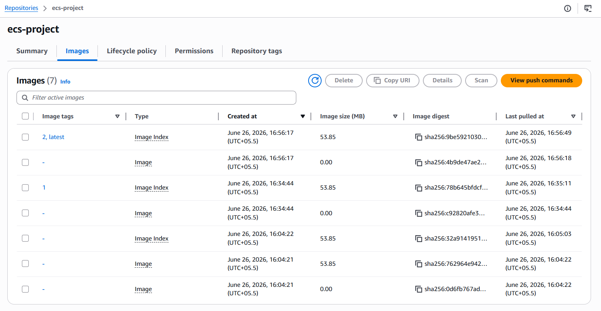

# 🚀 DevOps Toolbox: AWS ECS Fargate Deployment


Welcome to **DevOps Toolbox**, a fully automated, production-ready DevOps portfolio project. This repository demonstrates a complete CI/CD lifecycle, Infrastructure as Code (IaC), container orchestration, and DevSecOps best practices.

<p align="center">
  
</p>

---

## ✨ Highlights & Features

- **Infrastructure as Code (IaC):** Modular Terraform setup provisioning a custom VPC, ALB, ECR, and ECS Fargate cluster with remote S3 state and DynamoDB locking.
- **Serverless Compute:** Fully managed AWS ECS Fargate containers with target-tracking auto-scaling.
- **Automated CI/CD:** A GitOps-driven Jenkins declarative pipeline (Build, Scan, Push, Deploy).
- **DevSecOps:** Aqua Trivy integration scanning both the filesystem and built Docker images for vulnerabilities before deployment.
- **Observability:** Custom Grafana dashboards visualizing CloudWatch metrics (CPU, Memory, 5xx Errors, ALB Request Count).
- **Security:** Strict IAM roles, private Security Groups, and IAM Instance Profiles (No static AWS Keys!).

---

## 📸 Project Showcase

### 1. The Application: DevOps Toolbox
A custom Python FastAPI application containing various daily utilities for DevOps engineers.
<p align="center">
  
  
  
  
</p>

### 2. CI/CD & DevSecOps
Fully automated deployment pipeline with security vulnerability scanning blocking bad builds.
<p align="center">
  
</p>
<p align="center">
  
  
</p>

### 3. AWS Infrastructure & Container Registry
Secure, serverless execution and private container registry.
<p align="center">
  
  
</p>

### 4. Observability & Monitoring
Real-time monitoring of application health and infrastructure performance.
<p align="center">
  
</p>

---

## 💰 FinOps & Cost Estimation
Cloud Financial Management (FinOps) was a core consideration for this project. The architecture was deliberately designed to be cost-effective for a portfolio/startup environment while maintaining a strong security posture.

| Resource | Specification | Estimated Cost (Monthly) |
|----------|---------------|--------------------------|
| **Application Load Balancer** | 1 ALB (us-east-1) | ~$16.00 |
| **ECS Fargate** | 2 Tasks (0.25 vCPU, 0.5 GB) | ~$16.00 |
| **Jenkins Server** | 1 EC2 (t3.micro) | ~$7.50 |
| **Storage & State** | S3 & DynamoDB | ~$1.00 |
| **Total Estimated Cost** | | **~$40.50 / month** |

> **Architectural Trade-off (Cost vs. Isolation):** 
> By utilizing a **Public Subnet architecture** restricted by tight **Security Groups** (tasks only accept traffic from the ALB), this design avoids the need for AWS NAT Gateways and VPC Endpoints. This deliberate architectural decision saves approximately **$55 to $90 per month** in baseline networking costs, achieving a secure environment without the enterprise price tag.

---

## 📂 Repository Structure

```text
├── app/                      # FastAPI Python Application
│   ├── main.py               # Entrypoint & /health route
│   ├── Dockerfile            # Multi-stage production build (non-root user)
│   ├── routers/              # Application routes
│   └── tests/                # Pytest unit tests for application logic
├── terraform/                # Infrastructure as Code
│   ├── main.tf               # Calls modules (VPC, ALB, ECS, ECR, Security)
│   ├── backend.tf            # Configures S3 backend + DynamoDB state locking
│   ├── iam.tf                # IAM Instance Profile for Jenkins server
│   └── modules/              # Individual modular components
├── jenkins/                  # Pipeline definition
│   └── Jenkinsfile           # Declarative CI/CD pipeline
├── scripts/                  # Bootstrapping utility scripts
│   ├── bootstrap-backend.sh  # Sets up remote state S3 bucket & DynamoDB table
│   ├── cleanup-backend.sh    # Safely destroys S3 and DynamoDB remote state
│   └── setup-jenkins.sh      # Installs Jenkins, Docker, Trivy, CLI, Terraform & Grafana
├── docs/                     # Documentation and showcase screenshots
└── monitoring/               # Observability configurations
    └── grafana-dashboard.json# Pre-configured Grafana dashboard template
```

---

## 🚀 Setup & Deployment Guide

### 1. Local Development (Docker Compose)
You can easily run the application locally without deploying it to AWS. 
```bash
docker-compose up --build
```
The application will be available at `http://localhost:8000`. Test the health endpoint at `http://localhost:8000/health`.

### 2. Bootstrap S3 and DynamoDB for State Locking
Before initializing Terraform, you must create the S3 bucket and DynamoDB table to store the state files and prevent concurrent executions.
```bash
./scripts/bootstrap-backend.sh
```

### 3. Deploy the Infrastructure (Terraform)
Rename or modify the variables in `terraform/environments/dev/terraform.tfvars`, then deploy:
```bash
cd terraform
terraform init
terraform apply -var-file="environments/dev/terraform.tfvars" -auto-approve
```

### 4. Configure the Jenkins Server
Deploy the Jenkins server in a zero-touch fashion using **EC2 User Data**:
1. Launch an EC2 Instance (`t3.micro`, Ubuntu 24.04).
2. Attach the `ecs-project-jenkins-sg` Security Group and the `Jenkins-EC2-Deployer-Profile` IAM Role.
3. Paste the contents of `scripts/setup-jenkins.sh` into the **User Data** field.
4. Once booted, retrieve the initial admin password:
   ```bash
   sudo cat /var/lib/jenkins/secrets/initialAdminPassword
   ```

### 5. Create & Run the Jenkins Pipeline
1. Create a new Pipeline job in Jenkins.
2. Select **GitHub hook trigger for GITScm polling**.
3. Point the pipeline to your fork of this repository (`*/main` branch, `jenkins/Jenkinsfile`).
4. Add your AWS Account ID as a Global Secret Text credential named `aws-account-id`.
5. Push code to GitHub to trigger the automated security scanning and deployment to ECS Fargate!

### 6. Monitoring & Alerting (Grafana)
1. Open Grafana at `http://<ec2-public-ip>:3000` (default: `admin`/`admin`).
2. Add a **CloudWatch** Data Source using the EC2 IAM Role authentication.
3. Import the `monitoring/grafana-dashboard.json` file.
4. Enjoy real-time observability of your container metrics!
