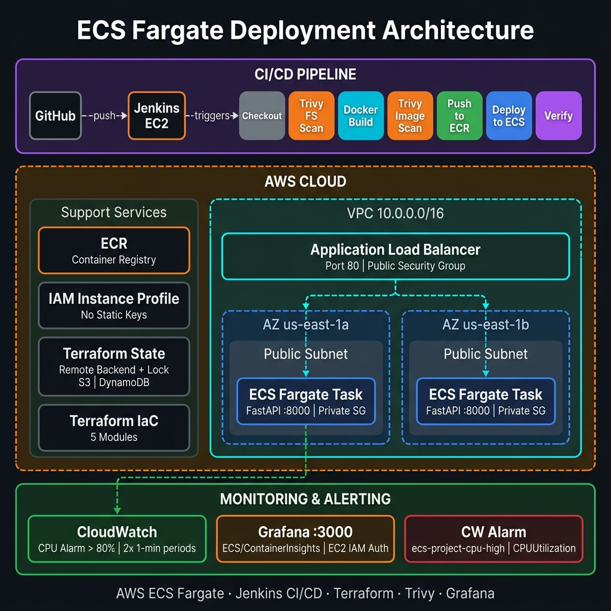

# AWS ECS Fargate Deployment with Jenkins CI/CD

This repository contains the code and infrastructure configuration to deploy a stateless FastAPI web application (DevOps Toolbox) to AWS ECS Fargate using a modular Terraform setup and a self-hosted Jenkins CI/CD pipeline.

<p align="center">
  
</p>

## System Architecture
* **Compute:** AWS ECS Fargate (stateless task container running on port 8000).
* **Load Balancing:** Application Load Balancer (ALB) exposing port 80 and forwarding to Fargate.
* **Networking:** Custom VPC with 2 public subnets in different Availability Zones.
* **Security:** Public Security Group for the ALB, private Security Group restricting Fargate task access solely to the ALB.
* **CI/CD:** Jenkins running on an EC2 instance, utilizing a Jenkinsfile declarative pipeline.
* **Security Scanning:** Trivy scanning filesystem and built Docker images.
* **Credentials:** IAM Instance Profile attached to Jenkins EC2 instance (eliminates static AWS Access Keys).

---

## Repository Structure

```text
├── app/                      # FastAPI Python Application
│   ├── main.py               # Entrypoint & /health route
│   ├── Dockerfile            # Multi-stage production build (non-root user)
│   ├── routers/              # Application routes
│   ├── services/             # Core business logic
│   └── tests/                # Pytest unit tests for application logic
├── terraform/                # Infrastructure as Code
│   ├── main.tf               # Calls modules (VPC, ALB, ECS, ECR, Security)
│   ├── backend.tf            # Configures S3 backend + DynamoDB state locking
│   ├── iam.tf                # IAM Instance Profile for Jenkins server
│   ├── outputs.tf            # Exports module outputs (e.g., ALB DNS, Cluster name)
│   ├── variables.tf          # Input variable definitions
│   └── modules/              # Individual modular components
├── jenkins/                  # Pipeline definition
│   └── Jenkinsfile           # Declarative CI/CD pipeline
├── scripts/                  # Bootstrapping utility scripts
│   ├── bootstrap-backend.sh  # Sets up remote state S3 bucket & DynamoDB table
│   └── setup-jenkins.sh      # Installs Jenkins, Docker, Trivy, CLI, Terraform & Grafana
├── docs/                     # Documentation and architecture diagrams
│   ├── architecture.png      # Architecture diagram of the ECS Fargate deployment
│   └── dashboard.png         # Example CloudWatch/Grafana dashboard view
└── monitoring/               # Observability configurations
    └── grafana-dashboard.json# Pre-configured Grafana dashboard template
```

---

## Setup & Deployment Guide

### 1. Bootstrap S3 and DynamoDB for State Locking
Before initializing Terraform, you must create the S3 bucket and DynamoDB table to store the state files and prevent concurrent executions.

From your local machine with AWS credentials configured:
```bash
./scripts/bootstrap-backend.sh
```
This will automatically generate a globally unique S3 bucket named `ecs-project-tfstate-<your-account-id>` and a DynamoDB lock table named `terraform-state-lock`.

### 2. Update Configuration
Rename or modify the variables in `terraform/environments/dev/terraform.tfvars` with your specific settings:
```hcl
project    = "ecs-project"
aws_region = "us-east-1"
vpc_cidr   = "10.0.0.0/16"
app_port   = 8000
```

### 3. Deploy the Infrastructure
Initialize and apply the Terraform configuration:
```bash
cd terraform
terraform init
terraform apply -var-file="environments/dev/terraform.tfvars" -auto-approve
```
*Note: This will provision the VPC, ECR, ALB, Security Groups, ECS Cluster, ECS Service, and create the IAM Role/Instance Profile (`Jenkins-EC2-Deployer-Profile`).*

### 4. Configure the Jenkins Server
You can deploy and fully configure the Jenkins server in a zero-touch fashion using **EC2 User Data**:

1. **Launch an EC2 Instance:**
   * Choose an Ubuntu 22.04 or 24.04 AMI.
   * Choose `t2.micro` or `t3.micro`.
2. **Configure IAM Role & User Data:**
   * Under **Advanced Details**, set the **IAM Instance Profile** to `Jenkins-EC2-Deployer-Profile` (created during step 3).
   * Scroll down to the **User Data** field and paste the contents of `scripts/setup-jenkins.sh`.
3. **Retrieve Credentials:**
   * After the instance starts, it will take about 2–3 minutes to automatically install Jenkins, Docker, Trivy, AWS CLI, Terraform, and Grafana.
   * Simply SSH into the instance and run the following command to retrieve your initial Jenkins admin password:
     ```bash
     sudo cat /var/lib/jenkins/secrets/initialAdminPassword
     ```
   * *Note: You can monitor the progress of the automated user-data installation by tailing the cloud-init log:*
     ```bash
     tail -f /var/log/cloud-init-output.log
     ```

### 5. Create & Run the Jenkins Pipeline
This pipeline is fully automated and triggered by Git pushes/pull requests. It scans and builds the application code and deploys it to the pre-existing ECS Fargate infrastructure.

1. Create a new **Pipeline** job in Jenkins named `devops-toolbox-app`.
2. Under **Build Triggers**, select **GitHub hook trigger for GITScm polling**.
3. In the **Pipeline** section, configure:
   * **Definition:** Pipeline script from SCM
   * **SCM:** Git
   * **Repository URL:** Your GitHub fork repository URL
   * **Branch Specifier:** `*/main`
   * **Script Path:** `jenkins/Jenkinsfile`
4. **Configure Jenkins Credentials**:
   * Go to **Manage Jenkins** > **Credentials** > **System** > **Global credentials**.
   * Add a new credential of type **Secret text**.
   * Set **ID** to `aws-account-id` and set the **Secret** to your 12-digit AWS Account ID (needed by the pipeline to construct the ECR registry URI).
5. **Set up GitHub Webhook**: Add a webhook in your repository settings pointing to `http://<jenkins-ec2-public-ip>:8080/github-webhook/`.
6. **Deploy**: Push a commit or click **Build Now** in Jenkins to trigger the automated security scanning and deployment to ECS Fargate.

---

## Monitoring & Alerting Setup (Grafana & CloudWatch)

### Grafana Dashboards
Grafana is automatically installed on port 3000 by the setup script.
1. Open `http://<your-ec2-public-ip>:3000` (default credentials: `admin` / `admin`).
2. Add a new Data Source: Select **CloudWatch**.
3. Set Authentication Provider to **EC2 IAM Role** and select region `us-east-1`.
4. Create a new dashboard querying the `ECS/ContainerInsights` namespace for your CPU and Memory metrics.

### Threshold-Based Alerting (CloudWatch Alarm)
The Terraform ECS module automatically provisions an active threshold-based CloudWatch metric alarm (`ecs-project-cpu-high`).
* **Metric Monitored:** `CPUUtilization` (Average) under `AWS/ECS`.
* **Alarm Condition:** Triggers if average CPU utilization exceeds `80%` over 2 consecutive evaluation periods of 1 minute (`period = 60`, `evaluation_periods = 2`).


