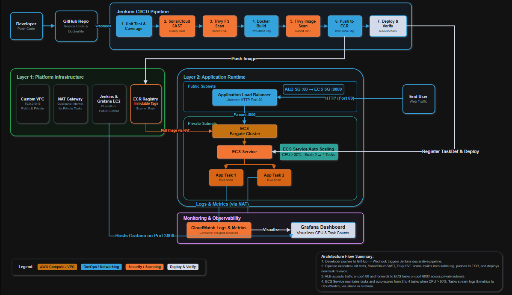
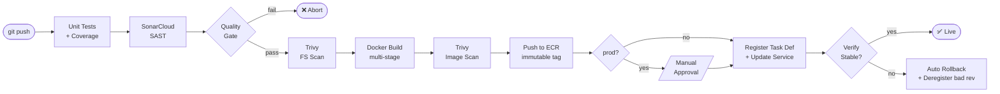
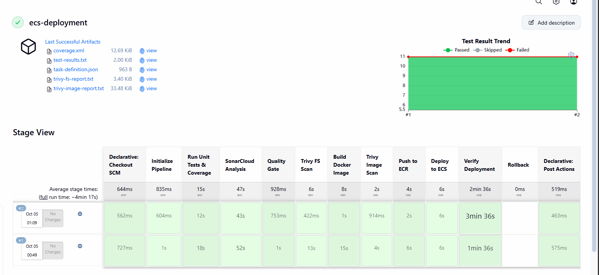
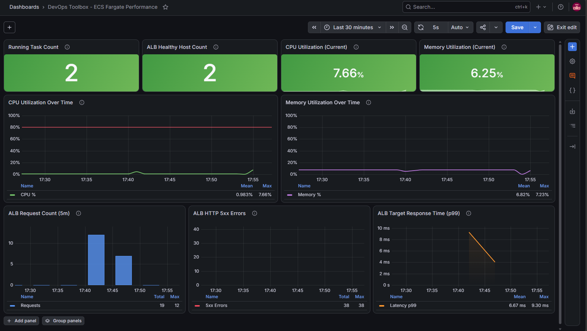
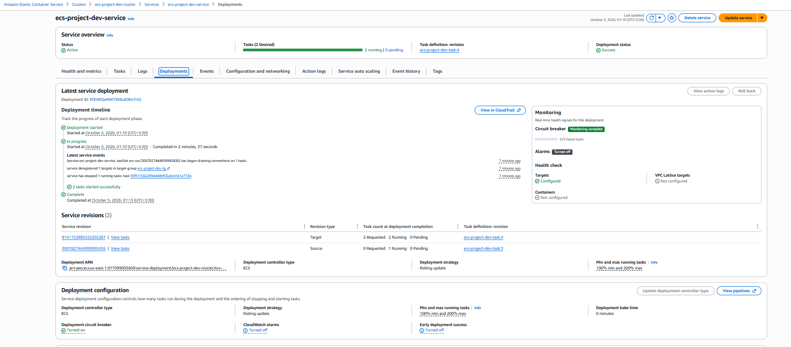
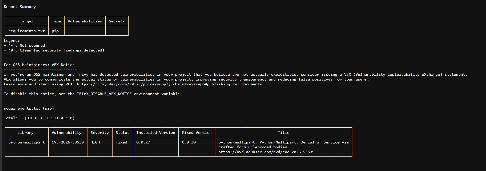

<div align="center">

# 🚀 DevOps Toolbox — Zero-Downtime CI/CD to AWS ECS Fargate

**From `git push` to a production-grade container rollout in private subnets, with quality gates, CVE scanning, auto-rollback and live observability, all built as code.**

[](#)
[](./terraform)
[](./jenkins/Jenkinsfile)
[](./app/Dockerfile)
[](./app/sonar-project.properties)
[](#devsecops)
[](./monitoring)
[](./app)

[**📸 Visual Walkthrough**](./docs/SHOWCASE.md) · [**🏗️ Terraform Design**](./terraform/README.md) · [**⚙️ Pipeline**](./jenkins/Jenkinsfile) · [**📊 Dashboard**](./monitoring/grafana-dashboard.json)



</div>

---

## ⚡ TL;DR

| | |
|---|---|
| 🎯 **What** | End-to-end delivery platform for a Python FastAPI app (4 DevOps utilities) on **AWS ECS Fargate** |
| 🏗️ **IaC** | **Terraform**: 4 reusable modules, **two-layer state isolation** (platform / app), `dev` + `prod` environments |
| 🔁 **CI/CD** | **Jenkins** declarative pipeline, **12 stages**: test → quality gate → scan → build → push → approve → deploy → verify → rollback |
| 🛡️ **Security** | SonarCloud SAST + Quality Gate, Trivy FS & image scans, ECR scan-on-push, private subnets, IAM roles with **zero static keys** |
| 🔄 **Releases** | **Immutable** `<build>-<git-sha>` tags, task definitions pinned per build, **automatic rollback** (pipeline + ECS circuit breaker) |
| 📈 **Ops** | Target-tracking autoscaling (**2 → 4 tasks @ 70% CPU**), CloudWatch alarms, **9-panel Grafana** dashboard |
| 💰 **FinOps** | Full stack runs for **~$95/month**, with scripted teardown |

---

## 🧭 Table of Contents

- [Pipeline Flow](#cicd-pipeline-flow)
- [Engineering Highlights](#engineering-highlights)
- [Tech Stack](#tech-stack)
- [Screenshots](#screenshots)
- [Repository Structure](#repository-structure)
- [Getting Started](#getting-started)
- [Cost Breakdown](#cost-breakdown)
- [Challenges & Lessons Learned](#challenges--lessons-learned)
- [Roadmap](#roadmap)

---

## <a id="cicd-pipeline-flow"></a>🔁 CI/CD Pipeline Flow


```mermaid
flowchart LR
    A([git push]) --> B[Unit Tests<br/>+ Coverage]
    B --> C[SonarCloud<br/>SAST]
    C --> D{Quality<br/>Gate}
    D -- fail --> X([❌ Abort])
    D -- pass --> E[Trivy<br/>FS Scan]
    E --> F[Docker Build<br/>multi-stage]
    F --> G[Trivy<br/>Image Scan]
    G --> H[Push to ECR<br/>immutable tag]
    H --> I{prod?}
    I -- yes --> J[/Manual<br/>Approval/]
    I -- no --> K
    J --> K[Register Task Def<br/>+ Update Service]
    K --> L{Verify<br/>Stable?}
    L -- yes --> M([✅ Live])
    L -- no --> N[Auto Rollback<br/>+ Deregister bad rev]
```

Every report (JUnit, coverage, Trivy FS/image, rendered task definition) is **archived as a build artifact** for audit.

---

## <a id="engineering-highlights"></a>🌟 Engineering Highlights

<table>
<tr>
<td width="50%" valign="top">

### 🏗️ Two-Layer Terraform
- **Platform layer** (deploy once): VPC, NAT, ECR, Jenkins EC2 + IAM
- **App layer** (per env): ALB, ECS cluster/service, autoscaling, SGs
- App reads platform outputs via `terraform_remote_state`
- **Blast-radius isolation**: a failed app apply can't touch networking
- **S3 native state locking** (`use_lockfile`), no DynamoDB needed

</td>
<td width="50%" valign="top">

### 🔄 Safe, Traceable Releases
- ECR set to **`IMMUTABLE`** tags, no `:latest` drift
- Tag = `BUILD_NUMBER-gitSHA` → any running task traces to a commit
- Pipeline clones the task def with `jq` and pins the new image
- Terraform `ignore_changes` on `task_definition`, so infra applies **never revert a release**
- **Dual rollback**: pipeline verify-stage + ECS deployment circuit breaker

</td>
</tr>
<tr>
<td valign="top">

### <a id="devsecops"></a>🛡️ DevSecOps (Shift-Left)
- **SonarCloud** SAST, with the pipeline aborting on Quality Gate failure
- **Trivy** scans dependencies *and* the final image (HIGH/CRITICAL)
- **ECR scan-on-push** as a second line of defence
- Multi-stage Dockerfile, **non-root user**, `HEALTHCHECK`, `.dockerignore`
- ECS tasks in **private subnets**, `assign_public_ip = false`
- **SG-to-SG** rule: only the ALB can reach port 8000

</td>
<td valign="top">

### 📈 Reliability & Observability
- **2–4 Fargate tasks** with target-tracking scaling on CPU
- ALB health checks + container `HEALTHCHECK` on `/health`
- **Container Insights** + CloudWatch CPU alarm (>80%)
- Grafana dashboard: tasks, healthy hosts, CPU/mem, requests, **5xx**, **p99 latency**
- Grafana authenticates through the **EC2 IAM role**, so it needs no keys
- Pipeline guardrails: timeouts, no concurrent builds, log rotation

</td>
</tr>
</table>

---

## <a id="tech-stack"></a>🧰 Tech Stack

| Category | Tools |
|---|---|
| **Cloud** | AWS: ECS Fargate, ECR, ALB, VPC, NAT Gateway, EC2, IAM, S3, CloudWatch, Application Auto Scaling |
| **IaC** | Terraform (modules, remote state, per-environment `tfvars`) |
| **CI/CD** | Jenkins (Declarative Pipeline, parameterised environments, approval gate) |
| **Containers** | Docker (multi-stage builds), Docker Compose |
| **Security** | SonarCloud, Aqua Trivy, ECR image scanning, IAM least-privilege roles |
| **Observability** | Grafana, CloudWatch Metrics, Container Insights, CloudWatch Logs |
| **App & Testing** | Python 3.11, FastAPI, Jinja2, Pytest + coverage |
| **Scripting** | Bash (backend bootstrap/cleanup, Jenkins host provisioning) |

---

## <a id="screenshots"></a>📸 Screenshots

> Full annotated walkthrough → **[docs/SHOWCASE.md](./docs/SHOWCASE.md)**

<table>
<tr>
<td width="50%"><p align="center"><b>Jenkins Pipeline: all stages green</b></p></td>
<td width="50%"><p align="center"><b>Grafana: live ECS & ALB metrics</b></p></td>
</tr>
<tr>
<td><p align="center"><b>ECS Fargate Service</b></p></td>
<td><p align="center"><b>Trivy CVE Scan Report</b></p></td>
</tr>
</table>

---

## <a id="repository-structure"></a>📁 Repository Structure

```text
.
├── app/                         # FastAPI application (containerised)
│   ├── main.py                  # Entrypoint + /health endpoint
│   ├── routers/ services/       # CIDR, Cron, K8s manifest, Dockerfile linter
│   ├── templates/ static/       # Jinja2 UI
│   ├── tests/                   # Pytest suite (11 tests)
│   ├── Dockerfile               # Multi-stage, non-root, HEALTHCHECK
│   └── sonar-project.properties # SonarCloud config
├── terraform/
│   ├── platform/                # Layer 1: VPC, NAT, ECR, Jenkins EC2, IAM
│   ├── app/                     # Layer 2: ALB, ECS, autoscaling, SGs
│   │   └── environments/{dev,prod}/
│   └── modules/                 # networking · alb · ecs · ecr
├── jenkins/Jenkinsfile          # 12-stage declarative pipeline
├── monitoring/                  # Grafana dashboard (JSON, importable)
├── scripts/                     # State bootstrap/cleanup, Jenkins host setup
├── docs/
│   ├── SHOWCASE.md              # Visual walkthrough
│   └── screenshots/             # application · pipeline · security · infrastructure · monitoring
└── docker-compose.yml           # Local development
```

---

## <a id="getting-started"></a>🚀 Getting Started

### Run locally (≈30 seconds)

```bash
docker compose up --build
# App    → http://localhost:8000
# Health → http://localhost:8000/health
```

### Deploy to AWS

<details>
<summary><b>Prerequisites</b></summary>

- AWS account + CLI configured · Terraform ≥ 1.10 (for S3 native locking) · Docker
- SonarCloud account (free for public repos)

</details>

<details>
<summary><b>1️⃣ Bootstrap remote state</b></summary>

```bash
./scripts/bootstrap-backend.sh   # creates S3 bucket + generates backend.tf for both layers
```
</details>

<details>
<summary><b>2️⃣ Deploy the platform layer</b> (VPC, NAT, ECR, Jenkins)</summary>

Create an EC2 Key Pair for SSH access (or update `jenkins_key_name` in `terraform.tfvars` with an existing key):
```bash
aws ec2 create-key-pair --key-name my-jenkins-server-key --query 'KeyMaterial' --output text > my-jenkins-server-key.pem
chmod 400 my-jenkins-server-key.pem
```

Deploy platform infrastructure:
```bash
cd terraform/platform
terraform init && terraform apply
```
The Jenkins EC2 user-data runs [`setup-jenkins.sh`](./scripts/setup-jenkins.sh), installing Jenkins, Docker, Trivy and Grafana automatically.
</details>

<details>
<summary><b>3️⃣ Configure Jenkins + SonarCloud</b></summary>

1. Update `sonar.projectKey` and `sonar.organization` in [`app/sonar-project.properties`](./app/sonar-project.properties) with your SonarCloud account.
2. In SonarCloud, import this repo and generate a token (**My Account → Security → Global Analysis Token**).
3. In SonarCloud → Project → **Administration → Webhooks**: Click **Create**, Name `Jenkins`, URL `http://<jenkins-ip>:8080/sonarqube-webhook/`.
4. In Jenkins → **Manage Jenkins → Plugins → Available plugins**: Install **SonarQube Scanner**.
5. In Jenkins → **Manage Jenkins → System → SonarQube servers**: Name `SonarCloud`, Server URL `https://sonarcloud.io`, Auth token.
6. In Jenkins → **Manage Jenkins → Tools → SonarQube Scanner**: Name `sonar-scanner`, enable auto-install.
7. In Jenkins → **Credentials → System → Global credentials**: Add Secret Text with ID `aws-account-id`.
8. Create a Pipeline job pointing to this repo (`*/main`, `jenkins/Jenkinsfile`).
</details>

<details>
<summary><b>4️⃣ First pipeline run → deploy the app layer</b></summary>

On the first run the ECS service doesn't exist yet, so the pipeline builds, scans and pushes the image, then **skips deploy**. Next:

```bash
cd terraform/app

# Initialize backend for DEV (isolated state: app/dev/terraform.tfstate):
terraform init -backend-config="environments/dev/backend.hcl" -reconfigure
terraform apply -var-file="environments/dev/terraform.tfvars"

# (Optional) To deploy PROD (isolated state: app/prod/terraform.tfstate):
# terraform init -backend-config="environments/prod/backend.hcl" -reconfigure
# terraform apply -var-file="environments/prod/terraform.tfvars"
```
After this, every push to `main` performs a versioned rollout.
</details>

<details>
<summary><b>5️⃣ Monitoring</b></summary>

1. Open Grafana at `http://<jenkins-ip>:3000` (default: `admin/admin`).
2. Add a **CloudWatch** data source (Default region `us-east-1`, authentication: AWS SDK Default).
3. Import [`monitoring/grafana-dashboard.json`](./monitoring/grafana-dashboard.json).
4. Update ALB panel dimensions (`LoadBalancer`, `TargetGroup`) with your environment ARN suffixes:
   ```bash
   terraform -chdir=terraform/app output alb_arn_suffix
   terraform -chdir=terraform/app output target_group_arn_suffix
   ```
</details>

<details>
<summary><b>↩️ Manual rollback</b></summary>

```bash
# Rollback DEV:
aws ecs update-service --cluster ecs-project-dev-cluster \
  --service ecs-project-dev-service \
  --task-definition ecs-project-dev-task:<previous-revision>

# Rollback PROD:
aws ecs update-service --cluster ecs-project-prod-cluster \
  --service ecs-project-prod-service \
  --task-definition ecs-project-prod-task:<previous-revision>
```
</details>

<details>
<summary><b>🧹 Teardown</b></summary>

```bash
# 1. Destroy Application Layer (Dev)
cd terraform/app
terraform init -backend-config="environments/dev/backend.hcl" -reconfigure
terraform destroy -var-file="environments/dev/terraform.tfvars"

# (If Prod was also deployed, destroy Prod:)
# terraform init -backend-config="environments/prod/backend.hcl" -reconfigure
# terraform destroy -var-file="environments/prod/terraform.tfvars"

# 2. Destroy Platform Layer (including Jenkins EC2)
cd ../platform
terraform destroy

# 3. Clean up S3 Remote State Bucket
cd ../..
./scripts/cleanup-backend.sh
```
</details>

---

## <a id="cost-breakdown"></a>💰 Cost Breakdown

| Resource | Spec | Est. / month |
|---|---|---|
| Application Load Balancer | 1 ALB | ~$16.00 |
| ECS Fargate | 2 × (0.25 vCPU, 0.5 GB) | ~$16.00 |
| Jenkins + Grafana | 1 × EC2 `t3.medium` | ~$30.40 |
| NAT Gateway | Single-AZ | ~$32.00 |
| S3 remote state | Native locking, no DynamoDB | ~$0.10 |
| **Total** | | **≈ $94.50** |

> `us-east-1` on-demand pricing. A single NAT is a deliberate cost trade-off; see [Roadmap](#roadmap).

---

## <a id="challenges--lessons-learned"></a>🧠 Challenges & Lessons Learned

| Challenge | Solution |
|---|---|
| `terraform apply` kept reverting the image Jenkins had just deployed | Made CI/CD own `task_definition` via `lifecycle.ignore_changes`; Terraform only bootstraps the first revision |
| ECS circuit-breaker rollbacks still reported **"stable"**, so bad deploys looked successful | Verify stage asserts the **PRIMARY** deployment equals the new revision, otherwise it triggers rollback |
| Mutable `:latest` made it impossible to know what was running | Immutable ECR tags + `build-sha` versioning + per-build task definition revisions |
| Chicken-and-egg: ECS service needs an image, the pipeline needs a service | Pipeline publishes the image and skips deploy when no service exists; Terraform pins the newest image **by digest** |
| App changes risked breaking shared networking | Split Terraform into independent platform/app states |
| Root-owned files from Dockerised tests broke workspace cleanup | Tests and cleanup both run inside containers |

---

## <a id="roadmap"></a>🗺️ Roadmap: Production Hardening

Architectural improvements planned for enterprise-scale adoption:
- [ ] **High Availability:** Multi-AZ NAT Gateways across all availability zones (eliminating single-AZ egress SPOF)
- [ ] **Edge Security:** ACM SSL/TLS certificate termination on the ALB + AWS WAF (DDoS / rate-limiting)
- [ ] **Deployment Strategy:** Blue/Green deployments using AWS CodeDeploy with canary traffic shifting
- [ ] **Strict Security Gates:** Enforce Trivy blocking (`--exit-code 1`) on CRITICAL vulnerabilities
- [ ] **ChatOps:** Automated Slack notifications for deployment status and circuit-breaker rollbacks
- [ ] **GitOps Migration:** OIDC-based GitHub Actions or ArgoCD pipeline alternatives

