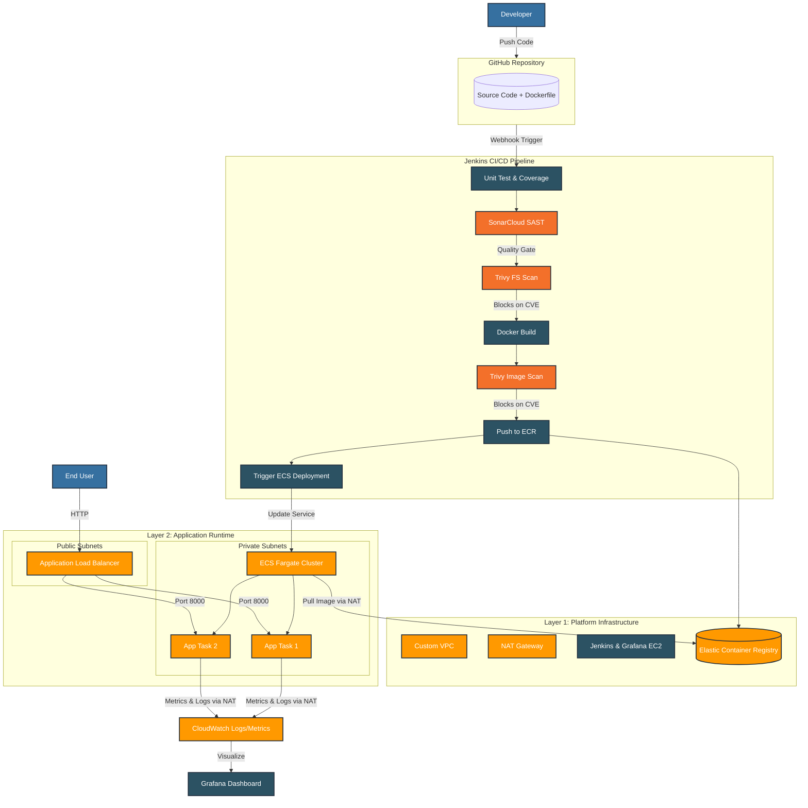

# DevOps Toolbox — AWS ECS Fargate Deployment


A production-grade DevOps portfolio project demonstrating a complete CI/CD lifecycle — from containerized application to automated AWS ECS Fargate deployment, with integrated security scanning and observability.

> 📸 **[View full project screenshots and visual walkthrough →](./docs/SHOWCASE.md)**


```mermaid
flowchart TD
    %% Define Styles
    classDef aws fill:#FF9900,stroke:#232F3E,stroke-width:2px,color:white;
    classDef devops fill:#2C5263,stroke:#232F3E,stroke-width:2px,color:white;
    classDef security fill:#F3702A,stroke:#232F3E,stroke-width:2px,color:white;
    classDef user fill:#3670A0,stroke:#232F3E,stroke-width:2px,color:white;

    %% Actors
    Dev[Developer]:::user
    EndUser[End User]:::user

    %% Source Control
    subgraph GitHub [GitHub Repository]
        Code[(Source Code + Dockerfile)]
    end

    %% Platform Foundation
    subgraph Platform [Layer 1: Platform Infrastructure]
        VPC[Custom VPC]:::aws
        NAT[NAT Gateway]:::aws
        Jenkins[Jenkins & Grafana EC2]:::devops
        ECR[(Elastic Container Registry)]:::aws
    end

    %% CI/CD Pipeline
    subgraph Pipeline [Jenkins CI/CD Pipeline]
        Build[Unit Test & Coverage]:::devops
        Sonar[SonarCloud SAST]:::security
        TrivyFS[Trivy FS Scan]:::security
        DockerBuild[Docker Build]:::devops
        TrivyImage[Trivy Image Scan]:::security
        Push[Push to ECR]:::devops
        Deploy[Trigger ECS Deployment]:::devops
    end

    %% Application Runtime
    subgraph AppRuntime [Layer 2: Application Runtime]
        subgraph PublicSubnets [Public Subnets]
            ALB[Application Load Balancer]:::aws
        end

        subgraph PrivateSubnets [Private Subnets]
            ECS[ECS Fargate Cluster]:::aws
            Task1[App Task 1]:::aws
            Task2[App Task 2]:::aws
            ECS --> Task1
            ECS --> Task2
        end
    end

    CW[CloudWatch Logs/Metrics]:::aws
    Grafana[Grafana Dashboard]:::devops

    %% Flows
    Dev -->|Push Code| GitHub
    GitHub -->|Webhook Trigger| Build
    
    Build --> Sonar
    Sonar -->|Quality Gate| TrivyFS
    TrivyFS -->|Blocks on CVE| DockerBuild
    DockerBuild --> TrivyImage
    TrivyImage -->|Blocks on CVE| Push
    Push --> ECR
    Push --> Deploy
    
    Deploy -->|Update Service| ECS
    ECS -->|Pull Image via NAT| ECR
    
    EndUser -->|HTTP| ALB
    ALB -->|Port 8000| Task1
    ALB -->|Port 8000| Task2
    
    Task1 -->|Metrics & Logs via NAT| CW
    Task2 -->|Metrics & Logs via NAT| CW
    CW -->|Visualize| Grafana
```

---

## What This Project Demonstrates

| Pillar | Implementation |
|---|---|
| **Infrastructure as Code** | Two-Layer Terraform (Platform: VPC, NAT Gateway, ECR, Jenkins EC2; Application: ECS Fargate, ALB, Auto Scaling) |
| **CI/CD Automation** | Jenkins Declarative Pipeline (Build → Scan → Push → Deploy) |
| **DevSecOps** | SonarCloud SAST + Aqua Trivy CVE scanning before every deployment |
| **Container Orchestration** | AWS ECS Fargate with target-tracking auto-scaling (2 to 4 tasks) |
| **Observability** | Grafana dashboards on top of CloudWatch metrics (CPU, Memory, 5xx) |
| **Security & Isolation** | Private subnets for ECS tasks behind NAT Gateway, SG-to-SG mutual ingress, IAM instance profile (no static credentials) |
| **State Management** | S3 Native State Locking (`use_lockfile = true`, zero DynamoDB) with isolated state files for platform and app |

---

## Repository Structure

```text
.
├── app/                        # FastAPI Python application
│   ├── main.py                 # Entrypoint & /health route
│   ├── Dockerfile              # Multi-stage build, non-root user
│   ├── .dockerignore           # Prevents sensitive files leaking into image
│   ├── sonar-project.properties# SonarCloud static analysis config
│   ├── routers/                # API route handlers (CIDR, Cron, K8s, Dockerfile)
│   ├── services/               # Core business logic
│   ├── static/                 # CSS & static assets
│   ├── templates/              # Jinja2 HTML templates
│   └── tests/                  # Pytest unit tests & coverage
├── terraform/
│   ├── README.md               # Detailed Two-Layer Architecture guide
│   ├── platform/               # Layer 1: Platform Foundations (Deploy Once)
│   │   ├── main.tf             # Networking & ECR module calls
│   │   ├── iam.tf              # Jenkins EC2 IAM role & deployer policy
│   │   ├── jenkins.tf          # Jenkins EC2 instance & Security Group
│   │   ├── variables.tf        # Platform inputs
│   │   ├── outputs.tf          # Outputs exported for Layer 2 (VPC ID, subnets, ECR)
│   │   └── backend.tf.example  # S3 backend template (key: platform/terraform.tfstate)
│   ├── app/                    # Layer 2: Application Runtime (Per Environment)
│   │   ├── main.tf             # Reads platform state, provisions ALB & ECS
│   │   ├── security.tf         # ALB & ECS Security Groups
│   │   ├── variables.tf        # Application variables & overrides
│   │   ├── outputs.tf          # ALB DNS endpoint
│   │   ├── backend.tf.example  # S3 backend template (key: app/dev/terraform.tfstate)
│   │   └── environments/
│   │       ├── dev/            # Dev environment tfvars
│   │       └── prod/           # Prod environment tfvars
│   └── modules/                # Shared reusable Terraform modules
│       ├── networking/         # VPC, Public & Private Subnets, NAT GW, IGW
│       ├── alb/                # Application Load Balancer & Target Group
│       ├── ecs/                # ECS Cluster, Task Definition, Service, Auto Scaling
│       └── ecr/                # ECR Repository & Lifecycle Policies
├── jenkins/
│   └── Jenkinsfile             # Declarative pipeline definition
├── scripts/
│   ├── bootstrap-backend.sh    # S3 state bucket bootstrap with native locking
│   ├── cleanup-backend.sh      # Tears down remote state bucket & versions
│   └── setup-jenkins.sh        # Automated bootstrap for Jenkins, Docker, Trivy, Grafana
├── monitoring/
│   └── grafana-dashboard.json  # Pre-built CloudWatch dashboard template
└── docs/
    ├── SHOWCASE.md             # Visual walkthrough with screenshots
    └── screenshots/
```

---

## Architectural Design: Two-Layer Platform Isolation & Private Subnets

### 1. Two-Layer Infrastructure Isolation
To protect critical foundations from deployment churn, Terraform is structured into two independently deployed layers:
- **Layer 1 (Platform):** Provisions foundational VPC, NAT Gateway, ECR registry, and the Jenkins server with dedicated S3 state (`platform/terraform.tfstate`). Deployed once by platform administrators and rarely modified.
- **Layer 2 (Application):** Provisions the ALB, ECS Fargate cluster, tasks, security groups, and auto-scaling policies with separate S3 state (`app/dev/terraform.tfstate`). It dynamically queries Layer 1 outputs via `terraform_remote_state`.
- **Blast Radius Protection:** An application deployment error or state lock issue in the CI/CD pipeline can never corrupt or tear down VPC networking, NAT gateways, or container registries.

### 2. Network Isolation & Defense-in-Depth
- **Public Subnets:** Only host the Internet-facing Application Load Balancer, the NAT Gateway, and the Jenkins server.
- **Private Subnets:** ECS Fargate tasks run in private subnets with `assign_public_ip = false`. Direct inbound access from the Internet is completely blocked.
- **Outbound Egress:** Tasks pull images from ECR and stream logs to CloudWatch securely via the NAT Gateway.
- **Mutual Security Groups:** The ECS security group strictly allows inbound traffic on port 8000 *only* from the ALB security group ID.

---

## FinOps - Cost Estimate

| Resource | Specification | Est. Monthly Cost |
|---|---|---|
| Application Load Balancer | 1 ALB (us-east-1) | ~$16.00 |
| ECS Fargate | 2 Tasks × (0.25 vCPU, 0.5 GB) | ~$16.00 |
| Jenkins & Grafana Server | 1 EC2 t3.medium | ~$30.40 |
| NAT Gateway | 1 Single-AZ NAT Gateway | ~$32.00 |
| S3 Remote State | S3 Native Locking (zero DynamoDB) | ~$0.10 |
| **Total** | | **~$94.50 / month** |

> Estimates based on `us-east-1` on-demand pricing. Costs vary by region and usage.

---

## Quick Start

### Local Development

```bash
docker-compose up --build
# App: http://localhost:8000
# Health: http://localhost:8000/health
```

### Deploy to AWS

#### 1. Bootstrap Remote State
Initializes the S3 state bucket and generates `backend.tf` for both layers using S3 native state locking:
```bash
./scripts/bootstrap-backend.sh
```

#### 2. Deploy Layer 1 (Platform Foundation)
Provisions the VPC, NAT Gateway, ECR repository, and the Jenkins EC2 instance:
```bash
cd terraform/platform
terraform init
terraform apply -auto-approve
```
*Note: The Jenkins EC2 instance automatically installs Jenkins, Docker, Trivy, and Grafana on first boot via `scripts/setup-jenkins.sh` in its EC2 user data.*

#### 3. Deploy Layer 2 (Application Runtime)
Provisions the ALB, ECS Fargate cluster, tasks, and auto-scaling rules:
```bash
cd ../app
terraform init
terraform apply -var-file="environments/dev/terraform.tfvars" -auto-approve
```

#### 4. Configure SonarCloud (SaaS)
SonarCloud is free for public repositories - zero servers to manage:
1. Sign up at [sonarcloud.io](https://sonarcloud.io) with your GitHub account.
2. Import this repository and note your **Organization Key**.
3. Generate a token: **My Account → Security → Global Analysis Token**.
4. In Jenkins → Manage Jenkins → System → **SonarQube servers**:
   - Name: `SonarCloud`
   - Server URL: `https://sonarcloud.io`
   - Auth token: paste your token
5. In Jenkins → Tools → **SonarQube Scanner**: add and enable auto-install.

#### 5. Run the Jenkins Pipeline
1. In Jenkins, create a new Pipeline job pointing to this repository (`*/main`, `jenkins/Jenkinsfile`).
2. Add `aws-account-id` as a Global Secret Text credential.
3. Push code to `main` - the pipeline will automatically test, scan with SonarCloud, run Trivy CVE scans, build Docker image, push to ECR, and deploy to ECS.

#### 6. Grafana Monitoring
1. Open Grafana at `http://<jenkins-ec2-ip>:3000` (default: `admin/admin`).
2. Add a **CloudWatch** data source (authenticates via the EC2 IAM Role automatically).
3. Import `monitoring/grafana-dashboard.json` to monitor ECS CPU, memory, and Container Insights.

---

## Teardown

To destroy resources and avoid ongoing AWS charges:

```bash
# 1. Destroy Application Layer
cd terraform/app
terraform destroy -var-file="environments/dev/terraform.tfvars" -auto-approve

# 2. Destroy Platform Layer (including Jenkins EC2)
cd ../platform
terraform destroy -auto-approve

# 3. Clean up S3 State Bucket
cd ../..
./scripts/cleanup-backend.sh
```
