# Project Showcase — Visual Walkthrough

> Back to [README](../README.md)

A step-by-step visual walkthrough of the entire project — from the running application to the AWS infrastructure and CI/CD pipeline.

---

## Step 1 — The Application

A custom Python FastAPI application with four built-in DevOps utilities.

<p align="center">
  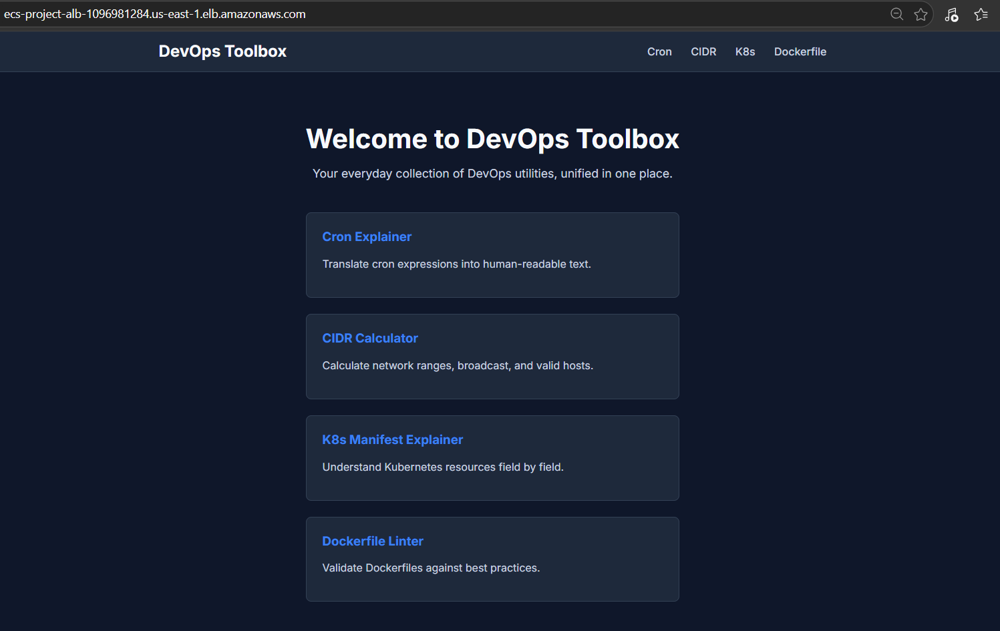
</p>

### Tools included

<p align="center">
  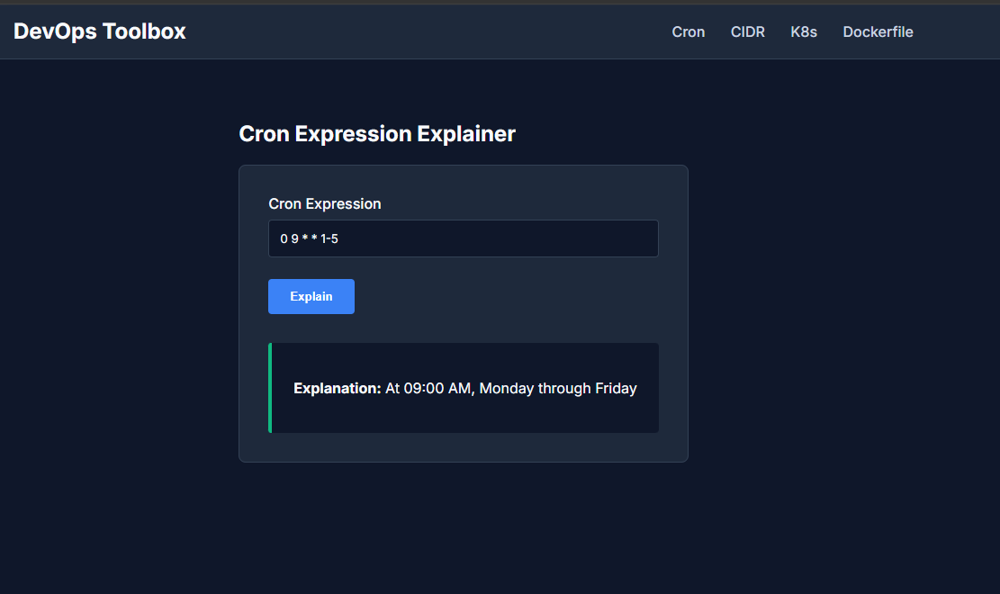
  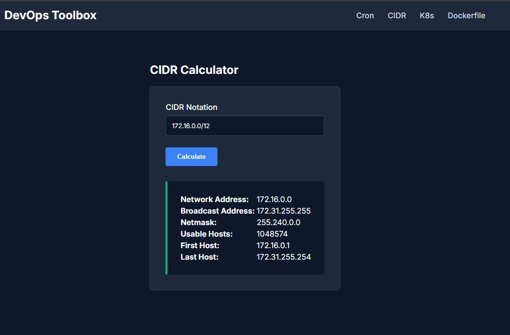
  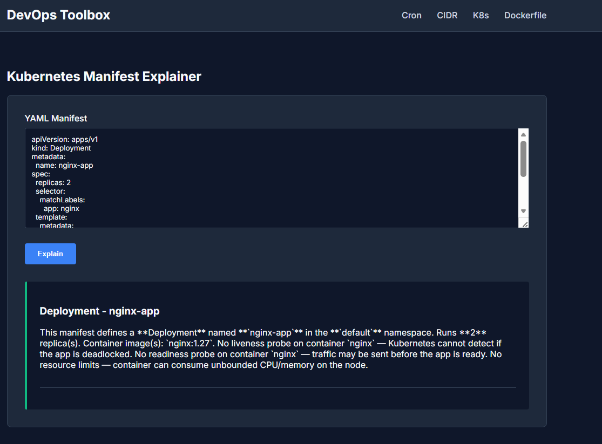
  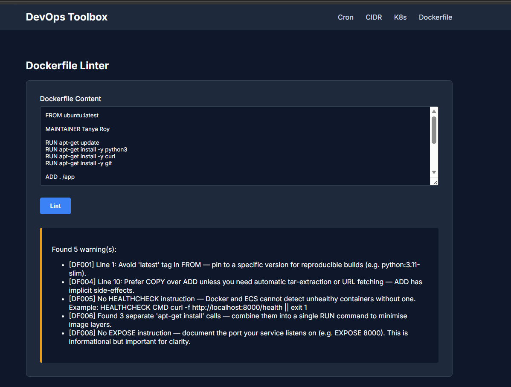
</p>

| Tool | What it does |
|---|---|
| **Cron Explainer** | Translates cron expressions into plain English |
| **CIDR Calculator** | Calculates subnet ranges from a CIDR block |
| **K8s Manifest Generator** | Generates a ready-to-use Kubernetes Deployment manifest |
| **Dockerfile Linter** | Validates a Dockerfile against best practices |

---

## Step 2 — CI/CD Pipeline (Jenkins)

Every push to `main` triggers the full Jenkins declarative pipeline automatically.

<p align="center">
  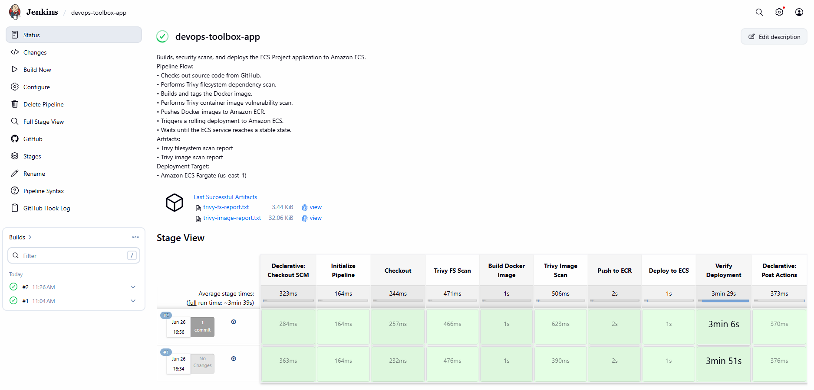
</p>

### Pipeline stages

```
Checkout → Unit Tests & Coverage → SonarCloud Analysis → Trivy FS Scan
→ Build Docker Image → Trivy Image Scan → Push to ECR → Deploy to ECS → Verify
```

### Build artifacts

All scan reports are archived as build artifacts for auditing.

<p align="center">
  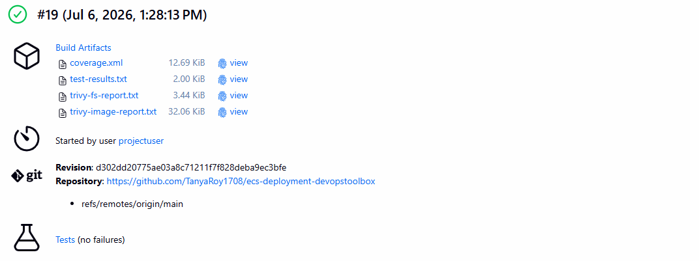
</p>

---

## Step 3 — Security Scanning

### SonarCloud — Static Analysis (SAST)

SonarCloud scans Python source code and the Dockerfile for bugs, vulnerabilities, and code smells on every build.

<p align="center">
  
</p>

### Trivy — CVE Vulnerability Scan

Aqua Trivy scans both the filesystem (dependencies) and the final Docker image for known CVEs before deployment is allowed.

<p align="center">
  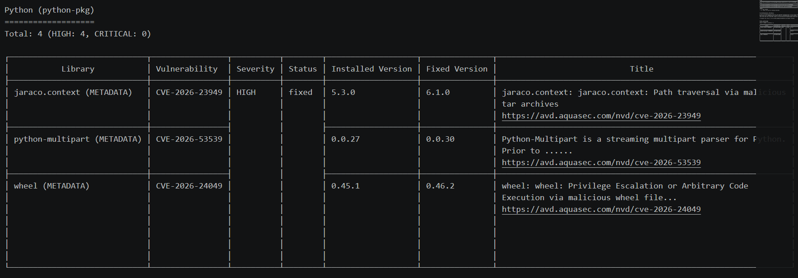
</p>

---

## Step 4 — AWS Infrastructure

### ECS Fargate Cluster

Two Fargate tasks running the application containers, managed by the ECS Service.

<p align="center">
  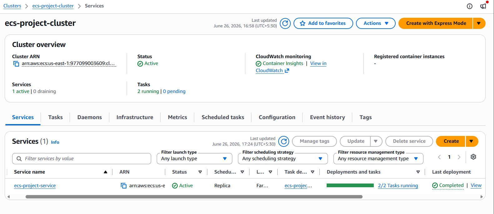
</p>

### ECR — Private Container Registry

Docker images are pushed to a private AWS ECR repository, tagged by Jenkins build number.

<p align="center">
  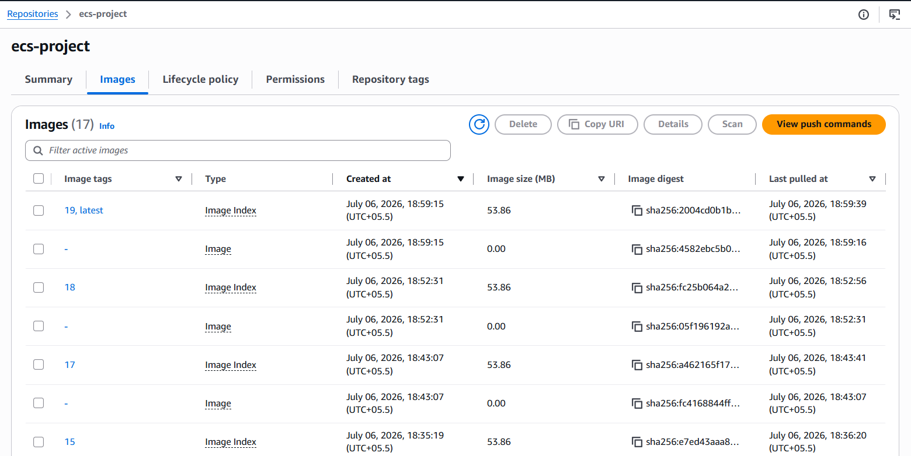
</p>

---

## Step 5 — Observability (Grafana + CloudWatch)

A pre-built Grafana dashboard monitors the live application using CloudWatch as the data source. No static AWS keys — authentication uses the EC2 IAM Role.

<p align="center">
  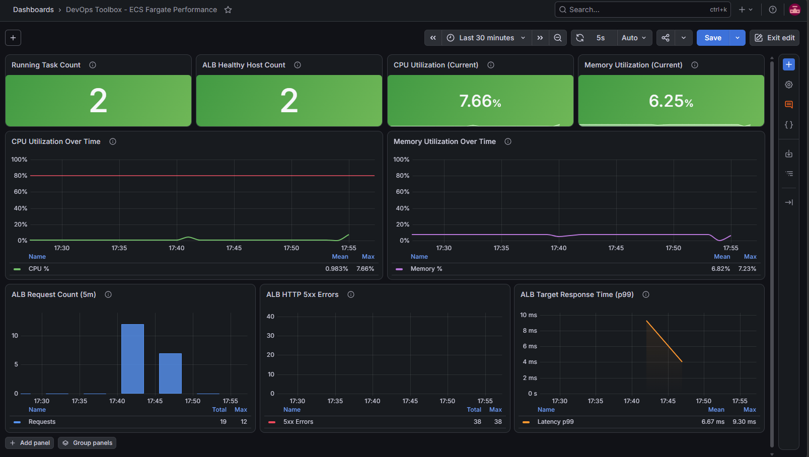
</p>

**Metrics tracked:**
- ECS CPU & Memory utilization
- ALB request count
- ALB HTTP 5xx error rate
- ECS running task count

---

## Architecture Diagram

```mermaid
flowchart TD
    %% Define Styles
    classDef aws fill:#FF9900,stroke:#232F3E,stroke-width:2px,color:white;
    classDef devops fill:#2C5263,stroke:#232F3E,stroke-width:2px,color:white;
    classDef security fill:#F3702A,stroke:#232F3E,stroke-width:2px,color:white;
    classDef user fill:#3670A0,stroke:#232F3E,stroke-width:2px,color:white;

    %% Actors
    Dev[Developer]:::user
    EndUser[End User]:::user

    %% Source Control
    subgraph GitHub [GitHub Repository]
        Code[(Source Code + Dockerfile)]
    end

    %% CI/CD Pipeline
    subgraph Pipeline [Jenkins CI/CD Pipeline]
        Build[Build & Unit Test]:::devops
        Sonar[SonarCloud SAST]:::security
        TrivyFS[Trivy FS Scan]:::security
        DockerBuild[Docker Build]:::devops
        TrivyImage[Trivy Image Scan]:::security
        Push[Push to ECR]:::devops
        Deploy[Trigger ECS Deployment]:::devops
    end

    %% AWS Infrastructure
    subgraph AWS [AWS Cloud Infrastructure]
        ECR[(Elastic Container Registry)]:::aws
        
        subgraph VPC [Custom VPC]
            ALB[Application Load Balancer]:::aws
            
            subgraph Public Subnets [Public Subnets (Secured via SG)]
                ECS[ECS Fargate Cluster]:::aws
                Task1[App Task 1]:::aws
                Task2[App Task 2]:::aws
                ECS --> Task1
                ECS --> Task2
            end
        end
        
        CW[CloudWatch Logs/Metrics]:::aws
    end

    %% Observability
    Grafana[Grafana Dashboard]:::devops

    %% Flows
    Dev -->|Push Code| GitHub
    GitHub -->|Webhook Trigger| Build
    
    Build --> Sonar
    Sonar -->|Quality Gate| TrivyFS
    TrivyFS -->|Blocks on CVE| DockerBuild
    DockerBuild --> TrivyImage
    TrivyImage -->|Blocks on CVE| Push
    Push --> ECR
    Push --> Deploy
    
    Deploy -->|Update Service| ECS
    ECR -->|Pull Image| ECS
    
    EndUser -->|HTTP/HTTPS| ALB
    ALB -->|Port 8000| Task1
    ALB -->|Port 8000| Task2
    
    Task1 -->|Metrics| CW
    Task2 -->|Metrics| CW
    CW -->|Visualize| Grafana
```
