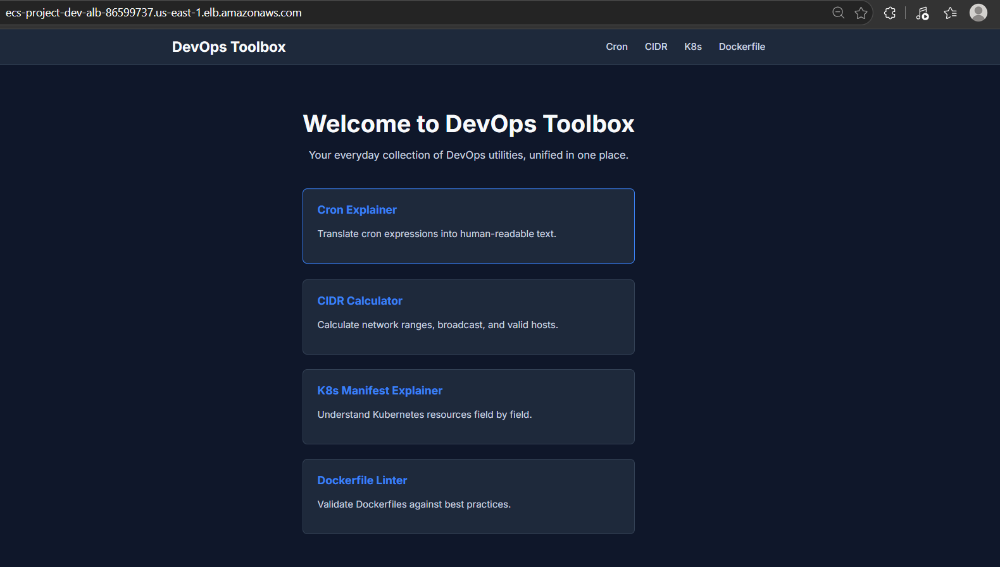
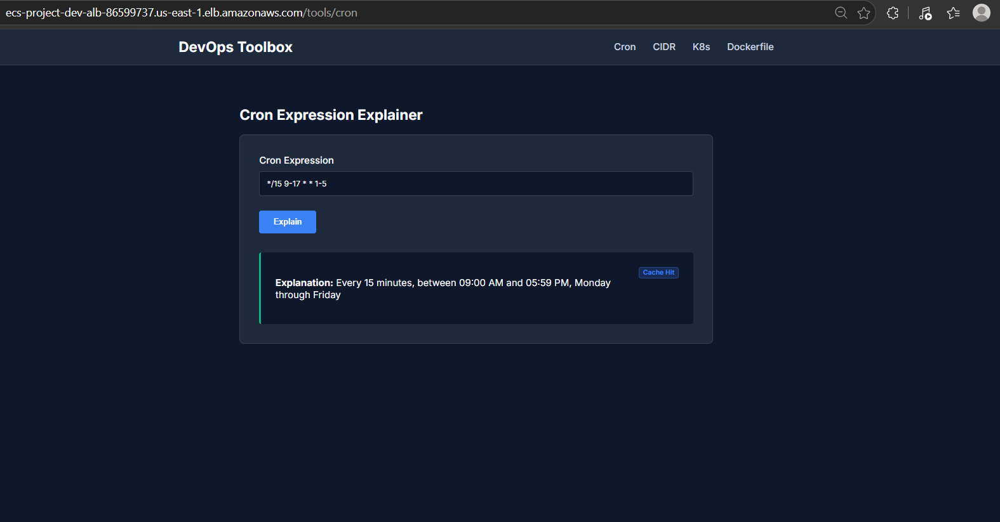
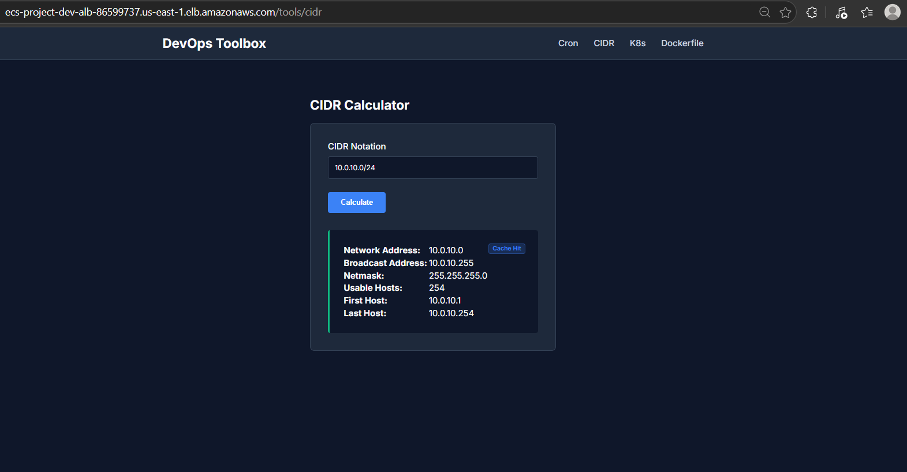
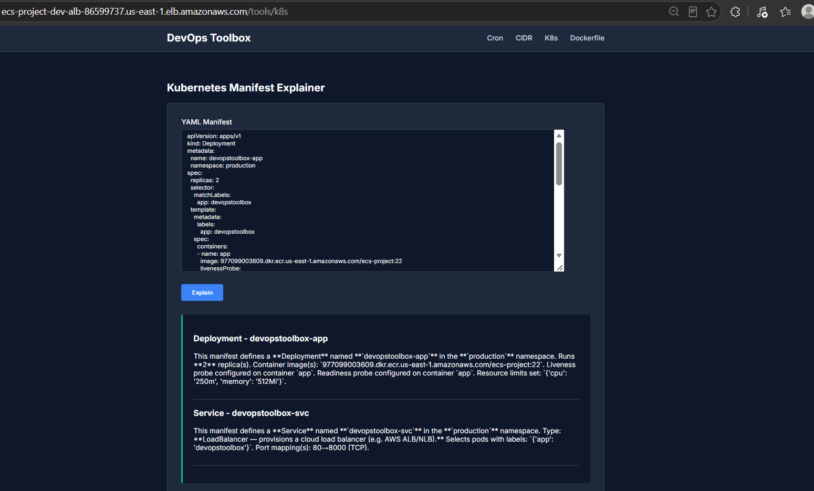
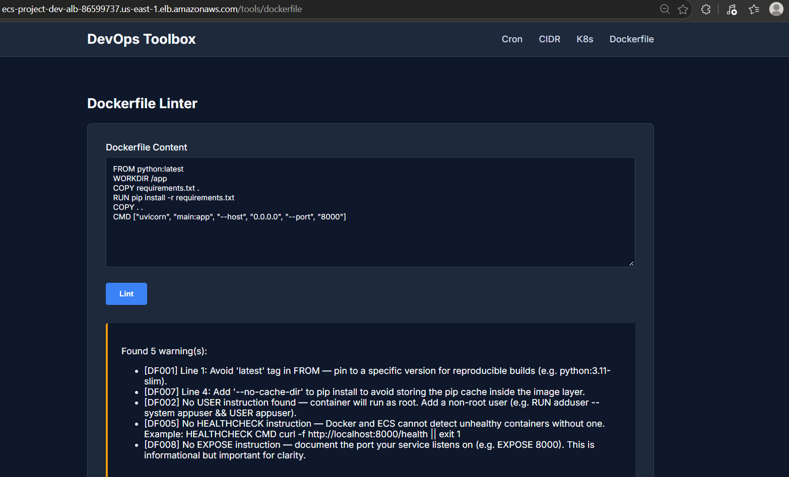
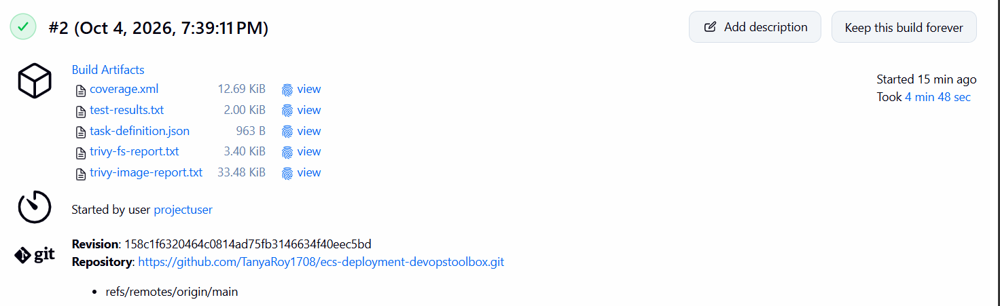
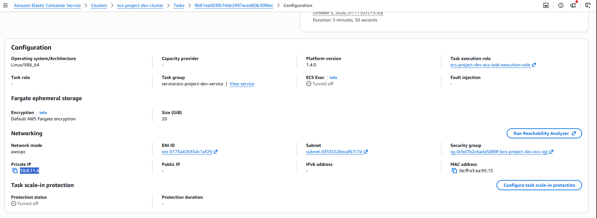
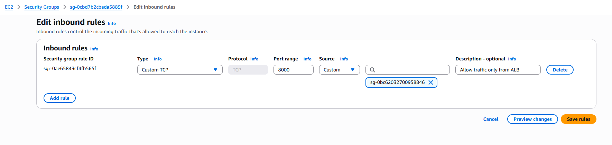
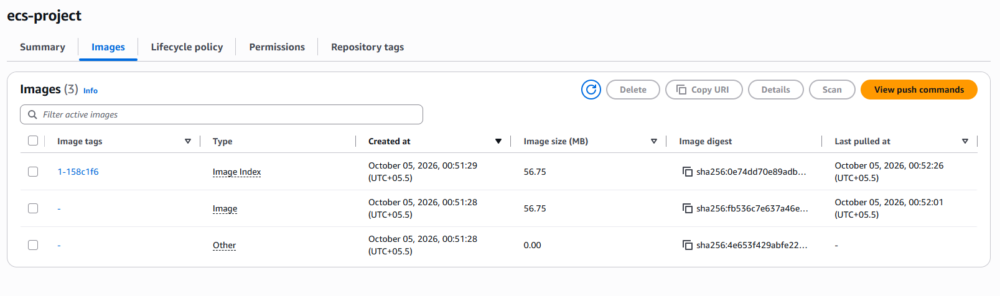
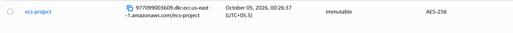

<div align="center">

# 📸 Project Showcase: Visual Walkthrough

**Proof the system actually runs: application → pipeline → security → infrastructure → observability**

[⬅ Back to README](../README.md)

</div>

---

## 🗺️ Architecture

<p align="center">
  
</p>

`git push` → **Jenkins** (public subnet) tests, scans and builds → pushes an immutable image to **ECR** → rolls out a new task definition to **ECS Fargate** (private subnets) behind an **ALB** → metrics flow to **CloudWatch** → visualised in **Grafana**.

---

## 1️⃣ The Application

A Python **FastAPI** app bundling four everyday DevOps utilities, packaged as a multi-stage, non-root Docker image.

<p align="center">
  
</p>

<table>
<tr>
<td width="50%"><p align="center"><b>⏰ Cron Explainer</b>: cron expression → plain English</p></td>
<td width="50%"><p align="center"><b>🌐 CIDR Calculator</b>: network, broadcast, host range</p></td>
</tr>
<tr>
<td><p align="center"><b>☸️ K8s Manifest Generator</b>: Deployment + Service YAML</p></td>
<td><p align="center"><b>🐳 Dockerfile Linter</b>: best-practice checks</p></td>
</tr>
</table>

---

## 2️⃣ CI/CD Pipeline (Jenkins)

A 12-stage declarative pipeline with a quality gate, security scans, a production approval gate, deployment verification and automatic rollback.

<p align="center">
  
</p>

```text
Initialize → Unit Tests & Coverage → SonarCloud → Quality Gate → Trivy FS Scan
→ Docker Build → Trivy Image Scan → Push to ECR → [Prod Approval]
→ Deploy to ECS → Verify Deployment → (Rollback on failure)
```

### 📦 Archived build artifacts

Test results, coverage, Trivy reports and the rendered task definition are kept with every build for audit.

<p align="center">
  
</p>

---

## 3️⃣ Security Scanning (DevSecOps)

**Aqua Trivy** scans both the dependency filesystem and the final image for HIGH/CRITICAL CVEs before anything reaches ECR. SonarCloud SAST runs earlier and **aborts the pipeline** if the Quality Gate fails.

<p align="center">
  
</p>

---

## 4️⃣ AWS Infrastructure (Terraform-provisioned)

### ECS Fargate Service

Tasks are managed by an ECS service with circuit-breaker rollback and 2→4 task autoscaling.

<p align="center">
  
</p>

### Tasks in Private Subnets

Tasks run with **no public IP**. Outbound traffic (ECR pulls, logs) goes through the NAT Gateway.

<p align="center">
  
</p>

### SG-to-SG Ingress

The ECS security group accepts port 8000 **only from the ALB security group**, never from CIDR ranges.

<p align="center">
  
</p>

### ECR: Immutable, Versioned Images

<table>
<tr>
<td width="50%"><p align="center"><b>Images tagged <code>build-gitsha</code></b></p></td>
<td width="50%"><p align="center"><b>Tag immutability enabled</b></p></td>
</tr>
</table>

---

## 5️⃣ Observability (Grafana + CloudWatch)

A version-controlled, importable Grafana dashboard backed by CloudWatch, authenticated via the **EC2 IAM role** with no static keys.

<p align="center">
  
</p>

| Panel | Why it matters |
|---|---|
| Running Task Count · ALB Healthy Hosts | Capacity & autoscaling behaviour |
| CPU / Memory (current + over time) | Right-sizing and scaling triggers |
| ALB Request Count | Traffic trends |
| ALB HTTP 5xx Errors | Error budget / deployment health |
| Target Response Time (p99) | Tail-latency SLO signal |

---

<div align="center">

[⬅ Back to README](../README.md)

</div>
